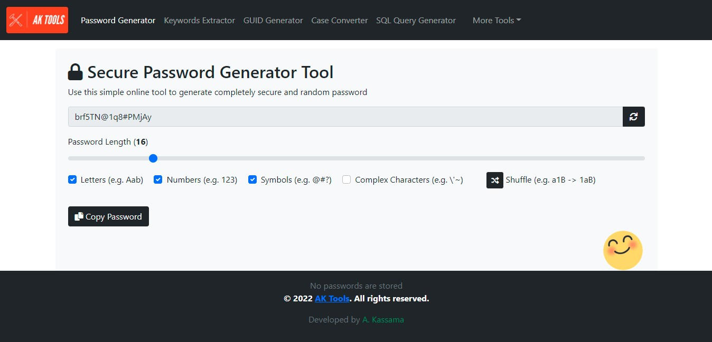

# password-generator

Generate completely secure and random passwords

  <kbd>
    
  </kbd>

## Description

A Strong Password Generator tool you can use to create secure passwords that are almost impossible to crack.

### Features

- Complex Passwords
- Simple Passwords
- Letters Only
- Numbers Only
- Symbols Only
- Shuffler
- Copy To Clipboard

### Built with

- Javascript
- HTML + CSS

### Demo

- [aktools.net/password-generator/](https://aktools.net/password-generator/)

## Getting started

### Install

All you have to do is download the source files, no configurations needed. Place the the files somewhere on your system and open the `index.html` file located at: `\password-generator\index.html`

### Usage

Simply set the length of the password using the range control. Optionally you can include or exclude Letters, Numbers, Symbols, and Complex Characters. You can also click on the re-load button to re-generate password or shuffle button the shuffle the current password string. Click the Copy PAssword button to copy password to clipboard.

### See also

- [sql-query-generator](https://github.com/akassama/sql-query-generator)
- [keywords-extractor](https://github.com/akassama/keywords-extractor)
- [guid-generator](https://github.com/akassama/guid-generator)
- [case-converter](https://github.com/akassama/case-converter)
- [text-notepad](https://github.com/akassama/text-notepad)
- [jquery-character-counter](https://github.com/akassama/jquery-character-counter)
- [bootstrap-search-autocomplete](https://github.com/akassama/bootstrap-search-autocomplete)
- [jquery-datables-crud](https://github.com/akassama/jquery-datables-crud)
- [bootstrap-search-autocomplete](https://github.com/akassama/bootstrap-search-autocomplete)
- [akassama-projects](https://github.com/akassama/projects)

### License

This project is licensed under the [MIT License](https://opensource.org/licenses/MIT).